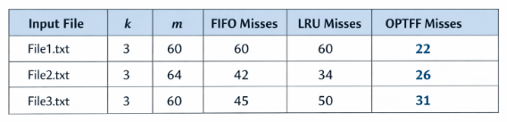

# COP4533 Programming Assignment 2
Thurstan Ngo - 86963382  
Syed Rahman - 95234900

## Running the Program
Type `python3 main.py input_file.txt` into the terminal to run the program (python3 may not be the command setup on your machine in which case you need to use what your computer has it set to)
* Replace `input_file` with one of the three input files: `File1.txt`, `File2.txt`, `File3.txt`

## Assumptions
* The name of input file is provided as command line argument when running main.py
* The input files are txt files
## Question 1: Empirical Comparison

* In all three of our cases, OPTFF had the lowest number of misses. This is expected since this way of caching uses future knowledge of request sequence to evict the data that will be used furthest into the future.

* FIFO and LRU both performed worse than OPTFF in all of our files. However, neither policy was doing better than the other consistently. In one instance they were equivalent, in another LRU was better, and in another FIFO was better.

## Question 2: Bad Sequence for LRU or FIFO
Yes there exists a squence in which OPTFF incurs strictly fewer misses than LRU
* Sequence: 1 2 3 4 1. For this sequence LRU inccurred 5 misses and OPTFF incurred only 4.
* The reasoning for this is beccause in the case of both it will miss the very first time a new request comes in however at the end 1 is requested again after the request for 4. In the case for LRU the cache state after 4 is [2, 3, 4] then 1 is requested causing a miss since it was evicted due to being the least recently used. In the case for OPTFF the cache state after 4 is [1, 2, 4] or [1, 3, 4] and when 1 is requested it is a hit since 1 was not evicted because the algorithm looked ahed into the sequence to see that 1 will be requested again thus evicting either 2 or 3 and preventing a miss.

## Question 3: Prove OPTFF is Optimal
Let S be the schedule produced by A. Let SFF be the schedule produced by OPTFF.  
Let S and SFF have the same eviction schedule through the first j steps.  
On step j + 1, let d be the requested item. Since S and SFF and agreed up until now, they each have the same cache contents before step j + 1.
* Case 1: d is already in the cache. Thus, S and SFF have the same eviction schedule through j + 1 steps.
* Case 2: d is not in the cache and S and SFF evict the same item. Thus, S and SFF have the same eviction schedule through j + 1 steps.
* Case 3: d is not in the cache; SFF evicts e; S evicts f $\neq$ e.
  * Let S' be the schedule after SFF evicts e. At this point, both S' and S have 1 cache miss.
  * Let Sʹ behave the same as S until S' is forced to take a different action.
  * Let j' be the first step after j + 1 that S' must take a different action from S; let g denote the item requested in step j'
    * Case 3a: g = e.
      * This can’t happen with OPTFF since there must be a request for f before e.
    * Case 3b: g = f.
      * Element f can’t be in the cache of S; let e' be the item that S evicts.
        * If eʹ = e, Sʹ accesses f from the cache; now S and Sʹ have the same cache contents.
        * If eʹ $\neq$ e, make Sʹ evict eʹ and bring e into the cache; now S and Sʹ have the same cache contents.
      * Let Sʹ behave exactly like S for remaining requests.
    * Case 3c: g $\neq$ e, f. S evicts e.
      * Make Sʹ evict f.
      * Now S and Sʹ have the same cache.
      * Let Sʹ behave exactly like S for the remaining requests.
